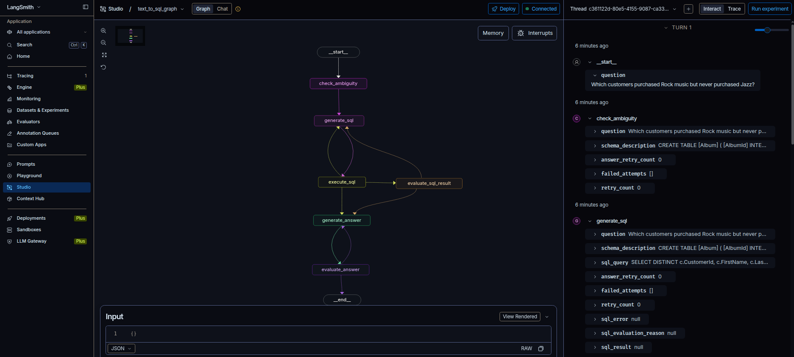
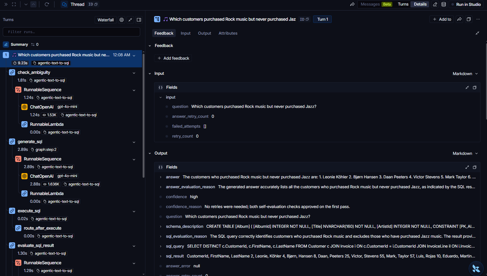
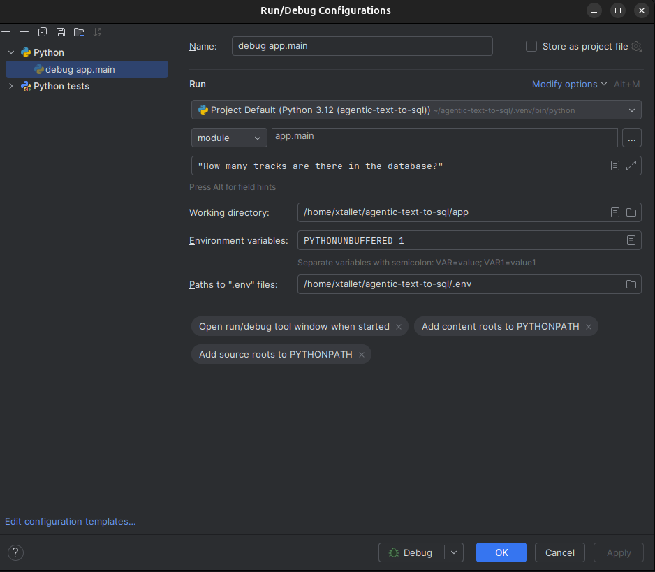

# 🤖 Agentic-Text-to-Sql

A LangGraph agent that answers natural language questions by generating and executing SQL sentences
against the [Chinook](https://github.com/lerocha/chinook-database) sample database, then
returns a natural language answer. <br> 
In this document [`solution.md`](./solution.md) I have described the architecture, design rationale, and trade-offs.

## Table of Contents

- [🛠️ Installation](#-installation)
- [🔐 Environment variables](#-environment-variables)
- [🚀 How to run](#-how-to-run)
  - [💲 Command Line](#-command-line)
  - [🧩 LangGraph Studio](#-langgraph-studio)
  - [🔭 LangSmith tracing](#-langsmith-tracing-optional)
  - [🐍 PyCharm](#-pycharm)
  - [🤝 Human-in-the-loop clarification](#-human-in-the-loop-clarification)
- [🧪 How to execute tests](#-how-to-execute-tests)
- [📌 Assumptions](#-assumptions)
- [🔎 Known limitations](#-known-limitations)


## 🛠️ Installation

Requirements: Python 3.11 or 3.12, and [`uv`](https://docs.astral.sh/uv/).<br>

For this project, I used **uv** as the package manager.<br> 
Below are the commands to create and activate the virtual environment and install the required dependencies.
```bash
git clone git@github.com:xtallet/agentic-text-to-sql.git
cd agentic-text-to-sql
uv venv
source .venv/bin/activate
uv sync
```

`uv sync` installs both runtime and dev dependencies (tests, `ruff`) into a local `.venv/`.

🧹 Follow this instructions in case you need to recreate the venv :
```bash
uv clean
deactivate
rm -rf .venv
uv venv
source .venv/bin/activate
uv sync
```
<br>
🛢️ The Chinook SQLite database (`data/chinook.db`) is already committed to the repo, so no
download step is required. If you ever need to re-fetch it:

```bash
./scripts/download_chinook.sh
```

## 🔐 Environment variables

Copy the environment template and fill in your OpenAI API key:

```bash
cp .env.example .env
```
Set in `.env` (loaded automatically, anchored to the project root regardless of your current
working directory):

| Variable | Required | Default | Description |
|---|---|---|---|
| `OPENAI_API_KEY` | Yes | — | Your OpenAI API key. |
| `OPENAI_MODEL` | No | `gpt-4o-mini` | Chat model used for every LLM call in the graph. |
| `CHINOOK_DB_PATH` | No | `data/chinook.db` (absolute, project-root-relative) | Path to the SQLite DB file. |
| `LANGSMITH_TRACING` | No | — | Set to `true` to enable [LangSmith](https://smith.langchain.com) tracing of every LLM call in the graph. |
| `LANGSMITH_API_KEY` | No | — | Your LangSmith API key. Only needed if `LANGSMITH_TRACING=true`. |
| `LANGSMITH_PROJECT` | No | — | LangSmith project name traces are grouped under. |
| `LANGSMITH_ENDPOINT` | No | `https://api.smith.langchain.com` | LangSmith API endpoint — override if your account is on the EU region (`https://eu.api.smith.langchain.com`). |

## 🚀 How to run
There are different ways to run the Agent locally, I am going to describe some of them.

### 💲 Command Line
```bash
uv run python -m app.main "How many tracks are there in the database?"
```
```
There are 3,503 tracks in the database.

Confidence: High (No retries were needed; both self-evaluation checks approved on the first pass.)
```
Every answer is followed by a **confidence level** (`High`/`Medium`/`Low`) with a short reason,
derived from whether any SQL/answer retries were needed and whether self-evaluation ultimately
approved the result — see `solution.md` for details.

### 🧩 LangGraph Studio

To see the graph in action you can also use LangGraph Studio, to inspect the graph visually and step through runs:

```bash
uv run langgraph dev
```
<p align="center"></p>

### 🔭 LangSmith tracing

If you fill in the `LANGSMITH_*` variables in `.env`, every run is traced to
[LangSmith](https://smith.langchain.com) with a readable run name (the question itself),
metadata (question, LLM model), and tags — useful for inspecting the full chain of LLM calls,
retries, and self-evaluations behind any given answer.<br> 
Tracing is entirely optional, the application works the same without it.

<p align="center"></p>

### 🐍 PyCharm
I have used PyCharm as IDE to develop all the code.<br>
It is very useful in case you want to debug and see step by step what happens.
In case you can use it, you have to configure it following the instructions below :

1. **Configure the interpreter** — `Settings/Preferences → Project: agentic-text-to-sql →
   Python Interpreter`. Point it to `.venv/bin/python` (created by `uv sync`). If it's not
   listed yet, add it via `Add Interpreter → Add Local Interpreter → Existing`.


2. **Create a Run/Debug Configuration** — `Run → Edit Configurations… → + → Python`.
   - **Name**: e.g. `debug app.main`
   - Switch the radio button from **"Script path"** to **"Module name"**, and enter: `app.main`
   - **Parameters**: your question in quotes, e.g. `"How many tracks are there in the database?"`
   - **Working directory**: the project root
   - **Environment variables**: PyCharm does not load `.env` automatically. Either:
     - Install the **EnvFile** plugin (`Settings → Plugins → Marketplace → "EnvFile"`),
       restart PyCharm, then use the new **EnvFile** tab in this same configuration to point
       to your `.env`, or
     - Paste the contents of `.env` manually into the **Environment variables** field.


3. **Interesting breakpoints** in `app/graph.py` — useful spots: `generate_sql`, `execute_sql`,
   `evaluate_sql_result`, `generate_answer`, `evaluate_answer`, or `check_ambiguity` to inspect
   the human-in-the-loop `interrupt()` call.

<p align="center"></p>


### 🤝 Human-in-the-loop clarification

If the agent judges your question ambiguous in a way that could produce a misleading answer
(e.g. a relative time period with no year, like "Q3"), it pauses and asks a clarifying question
directly in the terminal:

```bash
uv run python -m app.main "Which employee sold the highest number of invoices during Q3?"
# <clarifying question generated by the LLM, e.g. "Which year are you referring to for Q3?">
# > 2012
```
```
The employee who sold the highest number of invoices during Q3 is Margaret Park, with a total of 8 invoices.

Confidence: High (No retries were needed; both self-evaluation checks approved on the first pass.)
```

## 🧪 How to execute tests
Into the **tests** folder you will find both, unit and integration tests.<br>

To run them from the terminal, follow these instructions :
```bash
uv run pytest tests              # To run all tests
uv run pytest tests/unit         # unit tests only — mocked LLM, real SQLite adapter tests
uv run pytest tests/integration  # integration tests — real compiled graph + real DB,
                                 # deterministic scripted LLM (no network calls, no cost)
```
**NOTE** - I have used Pycharm to prepare, run and debug all the tests.

#### ✨ Linting/formatting:

```bash
uv run ruff check .
uv run ruff format .
```

## 📌 Assumptions

- **SQLite** is used as the Chinook backend.
- **OpenAI** is the only LLM provider wired up, via `langchain-openai`. Chosen explicitly for
  this project; multi-provider support was considered but not yet implemented (see `solution.md`).
- The app is a **CLI tool**, not a web service — no HTTP API layer was built (LangGraph Studio
  is available separately for visual inspection, not as a production API).
- The **checkpointer used for human-in-the-loop is in-memory only** (`InMemorySaver`) — state
  persists for the lifetime of a single `python -m app.main` process, not across restarts. This
  is sufficient for the CLI use case; a durable checkpointer would be needed for a long-running
  service (see `solution.md`).
- Chinook's `Customer`/`Employee` tables contain synthetic PII-shaped data (email, phone,
  address, birth date) — not real people, but the PII-masking guardrail treats those columns as
  sensitive regardless, since that's the realistic behavior a production system would need.

## 🔎 Known limitations

- **No query cost/timeout limit**: `SqliteAdapter.execute()` caps the number of *rows returned*
  (`MAX_ROWS = 200`), but SQLite still performs the full computation (joins, sorting) before
  that cap applies. An expensive-but-valid read-only query can still be slow. Low real risk on Chinook's small dataset; would matter on a larger DB.
- **Self-evaluation is not infallible**: the two self-evaluation nodes (`evaluate_sql_result`,
  `evaluate_answer`) are themselves LLM calls and can misjudge a correct result as wrong (a false
  rejection). Two concrete cases found during manual testing were fixed via prompt rules (see
  `solution.md`), but the underlying risk — a false rejection triggering a regenerate that
  produces a confidently wrong answer, which then passes the second evaluation — is a structural
  trade-off of this design, not something eliminated entirely.
- **Ambiguity detection is a single LLM judgement call**, not exhaustive: it catches common
  patterns (missing year on a relative period, undefined ranking metric) but isn't guaranteed to
  catch every ambiguous phrasing.
- **In-memory checkpointing only**: human-in-the-loop pauses do not survive a process restart.
- **No streaming**: responses are returned only once the full graph run completes; there is no
  token-by-token or intermediate-step streaming to the terminal.
