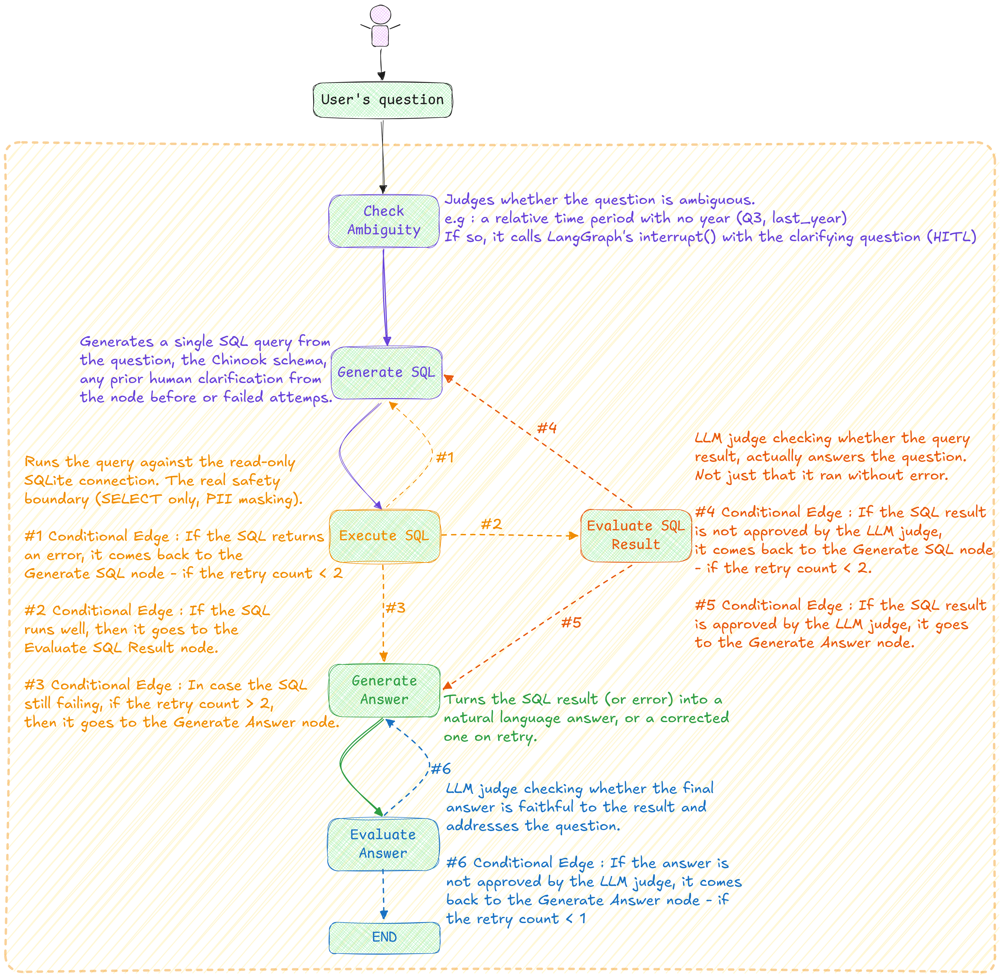

## Table of Contents

- [🏗️ 1. Architecture overview](#-1-architecture-overview)
- [🧠 2. Design rationale](#-2-design-rationale)
- [⚙️ 3. How the agentic workflow operates](#-3-how-the-agentic-workflow-operates)
- [🛡️ 4. Failure handling](#-4-failure-handling)
- [📝 5. Self-evaluation](#-5-self-evaluation)
- [🛡️ 6. Guardrails](#-6-guardrails)
- [📈 7. Scalability considerations](#-7-scalability-considerations)
- [⚖️ 8. Trade-offs](#-8-trade-offs)
- [🚀 9. Future improvements](#-9-future-improvements)
- [🧑🤖 10. Use of AI during development](#-10-use-of-ai-during-development)

## 🏗️ 1. Architecture overview

The system is a single LangGraph state machine that turns a natural language question into SQL,
executes it against Chinook, and turns the result back into a natural language answer — with
two self-evaluation checkpoints, a bounded self-correction loop, and an optional
human-in-the-loop pause for ambiguous questions.

#### 🧩 The codebase follows a hexagonal-architecture style:

- **`app/domain/`** — pure business logic, no framework/IO dependencies. 
  `models/agent_state.py` defines the LangGraph state (a plain pydantic `BaseModel`).  
  `ports/` defines two small ABCs (`LLMPort`, `SqlExecutorPort`) that the graph depends on as abstractions, not concrete
  implementations.  
 `validators/`, `prompts/`, and `exceptions/` hold pure, independently
  testable logic (schema validation, prompt-injection tag-wrapping, system prompts).
- **`app/infrastructure/`** — concrete adapters implementing the ports:  
  `OpenAiLlmAdapter` (LangChain `ChatOpenAI` wrapper)  
  `SqliteAdapter` (the actual safety boundary.  
  `services/langsmith.py` builds a per-question LangSmith run name/metadata/tags for
  observability. 
  `di/dependencies.py` wires them up via small `lru_cache`-decorated factory functions —
  no DI framework, just memoized constructors.
- **`app/graph.py`** — the LangGraph nodes (`async def node(state) -> state`) and
  `compile_graph()`, which is the only place that knows the graph's shape.
- **`app/main.py`** — a thin CLI entrypoint that also owns the human-in-the-loop
  interrupt/resume interaction loop (see §3).

**💡Why hexagonal architecture?**  Business logic never depends on concrete technical details
(which LLM, which database) — only on the abstract ports.  
This is what lets the integration tests swap `OpenAiLlmAdapter` for a fake `ScriptedLlmAdapter` without touching `graph.py` at
all.  
The same would apply to swapping SQLite for Postgres by writing a new `SqlExecutorPort`
implementation.

## 🧠 2. Design rationale

**🔀 Why LangGraph's conditional edges instead of a single "agent loop" with tool-calling?** 
The task has a small, well-defined set of stages (generate → execute → evaluate → answer →
evaluate) with clear success/failure semantics at each stage.  Modeling this explicitly as a
state graph with typed conditional edges makes the control flow legible and testable — each
routing decision (`route_after_execute`, `route_after_evaluate`, `route_after_answer_evaluation`)
is a small, pure, unit-tested function.

**🧱 Why a pydantic `BaseModel` for state instead of a `TypedDict`?**  Validation for free (type
coercion, required fields), and it matches the existing port convention (`ABC + pydantic
BaseModel`).

**🔍 Why introspect the schema at runtime instead of hardcoding it?**  
`SqliteAdapter.get_schema()` reads `sqlite_master` directly. A hardcoded schema string would silently drift from the real
database on any change — introspection makes that impossible by construction.

**🎯 Why `with_structured_output` everywhere instead of parsing free-text LLM responses?**  
Every LLM call in the graph that needs a decision (`SqlQuery`, `SqlEvaluation`, `AnswerEvaluation`,
`AmbiguityCheck`) uses structured output. This eliminates an entire class of bugs — no regex
against markdown fences, no "the model added a sentence before the SQL this time" — the response
is validated against a schema before the node ever sees it.

**🔌 Why OpenAI only?**  Chosen explicitly for this project. Multi-provider support was considered
(it's a listed bonus) but not implemented.

**🔭 Why LangSmith?**  The graph makes several LLM calls per question (ambiguity check, SQL
generation, two self-evaluations, answer generation, plus retries) — without tracing,
understanding *why* a particular retry happened means re-reading logs by hand. LangSmith gives
each run a readable name (the question itself) and metadata, making the full chain of calls
behind any answer inspectable. It's entirely optional (`LANGSMITH_*` env vars) — the app behaves
identically without it.

## ⚙️ 3. How the agentic workflow operates
In this section I am going to explain the workflow from scratch, starting from the user's question to the end - explaning what each node does, 

**🤝 check_ambiguity** :  
A structured-output LLM call (`AmbiguityCheck(is_ambiguous, clarifying_question)`) judges whether the question is ambiguous
in a way likely to produce a misleading or arbitrary answer — a relative time period with no
year ("Q3", "last year"), or a superlative with no defined metric ("best-selling"). 
It also receives the introspected schema (same `if state.schema_description is None` pattern as
`generate_sql`), and is explicitly instructed to only flag ambiguity — or ask a clarifying
question — that's actually resolvable via a real column, so it can't invent a dimension that has
no corresponding table or column in the data model.  If so, it
calls LangGraph's `interrupt()` with the clarifying question, which pauses the entire graph run
and returns control to the caller. `main.py` detects the pause (`result.get("__interrupt__")`),
prompts the user via `input()`, and resumes with `graph.ainvoke(Command(resume=answer), config)`
using the same `thread_id`.  
The user's answer is stored in `state.clarification` and folded into
every subsequent `generate_sql` prompt.  
This required adding a checkpointer (`InMemorySaver`, passed to `.compile()`) — LangGraph needs somewhere to persist state across a
pause, which doubles as a (partial) implementation of the "checkpointing and resumability" bonus.
A non-obvious LangGraph behavior worth calling out: on resume, the *entire* interrupted node
re-runs from the top, not just the code after `interrupt()` — so `check_ambiguity`'s LLM call
fires a second time on resume, before `interrupt()` returns the resume value instantly instead
of pausing again.  
This was confirmed both by unit-testing the node with a mocked `interrupt` and
by an integration test exercising the real interrupt/`Command` machinery end to end.

**🧾 generate_sql** :  
Builds a prompt from the question (plus clarification, plus any accumulated
retry history) and the introspected schema, and asks for a single SQL query via
structured output.  The generated query is then checked against `validate_sql_schema()` **before** touching the database.

**▶️ execute_sql** :  
Runs the query through `SqliteAdapter`, the actual safety boundary. 
Short-circuits immediately if `state.sql_error` is already set (e.g. by the schema validator),
so a rejected query never reaches the database at all. 
This node has 3 Conditional Edges : 
1 - If the SQL sentence runs well, it goes to the **evaluate_sql_result** node. 
2 - If the SQL sentence returns an error, it returns to the **generate_sql** node, incrementing the retry count +1. 
3 - If the SQL sentence is still failing and retry count is > 2, then it goes to the **generate_answer** node.

**🧠 evaluate_sql_result** :  
A second, independent LLM call judges whether the *result* actually
answers the question — not just "did it execute without error".  
This is the first self-evaluation checkpoint. 
This node has 2 Conditional Edges : 
1 - If it considers the SQL result answers the user's question, then it goes to the **generate_answer** node. 
2 - If it considers the SQL result does not answer the user's question, then it goes back to the **generate_sql** node, to give the LLM the opportunity to generate a new SQL sentence.  

**💬 generate_answer** :  
Turns the result (or the accumulated error) into a natural-language
answer, explicitly instructed not to invent facts not present in the result and not to expose
raw stack traces on failure.

**🧠 evaluate_answer** :  
A third LLM call judges whether the *generated answer* is faithful to the
result and actually addresses the question — the second self-evaluation checkpoint,
catching hallucination in the final phrasing step specifically, which `evaluate_sql_result`
cannot see (it only ever sees the raw SQL result, never the natural-language answer). 
This node has 1 Conditional Edge : 
1 - Based on the user's question, the SQL sentence generated and the SQL result, it judges if the answer generated is
faithfull with the SQL result, reducing the hallucinations. - But also judges if the generated answer addresses the question that was asked.

## 🛡️ 4. Failure handling

Every LLM call and every DB call in the graph is wrapped in `try/except`, and every failure is
captured into state (`sql_error`, `answer_error`) rather than raised — the graph always
completes and returns a value, it never crashes mid-run.

**🔄 SQL retry loop** :  
On any SQL error (LLM failure, schema-validation rejection, real SQLite
execution error, or a rejection from `evaluate_sql_result`), `generate_sql` appends
`"Attempt N:\nSQL: ...\nError: ..."` to `state.failed_attempts` and re-prompts with the **full**
accumulated history, not just the latest error — so the model doesn't repeat a mistake it
already made two attempts ago. Capped at `MAX_SQL_RETRIES = 2` (3 total attempts), on top of
LangGraph's own `recursion_limit` as a second backstop against infinite loops.

**🔄 Answer retry loop** :  
A separate, smaller budget (`MAX_ANSWER_RETRIES = 1`) for `evaluate_answer` rejections — regenerating a phrasing is a much simpler task than regenerating
SQL, so it needs far fewer attempts.  
If still rejected after the budget is exhausted, the system **returns the last generated answer anyway** rather than a generic "couldn't verify" message —
a deliberate fail-open choice, reasoned as better UX than blocking the user on a rejection that
is itself only ever as reliable as the LLM judging it.

**🐛✅ A real bug found and fixed during manual debugging, worth documenting because of what it
reveals about LangGraph's execution model**:  
`retry_count` was originally incremented inside `_route_on_error`, a routing function passed to `add_conditional_edges`. LangGraph only persists
state updates returned by actual *nodes*; a mutation made inside a routing function is discarded
as soon as that step ends. The counter silently stayed at 0 forever, and the graph looped past
its intended retry limit — routing functions are now purely read-only, as they should be.

## 📝 5. Self-evaluation

Two independent, structured-output LLM judges, deliberately kept separate rather than merged
into one, because they check different things:

- **🎯 evaluate_sql_result** (`SqlEvaluation(is_valid, reason)`):  
  Does the **data** answer the question?  
  Catches an empty result where data should exist ?
  A partial answer (missing a requested filter/aggregation)  
  Or a query that answers a different question than the one
  asked.

- **🎯 evaluate_answer** (`AnswerEvaluation(is_valid, reason)`):  
  Does the **phrasing** faithfully represent that data?  
  Catches invented numbers/facts not present in the result  
  An answer that doesn't address the question  
  Or one that leaks raw error internals to the user.

Both fail open on their own errors (log and proceed) — an evaluator outage should never block an
otherwise-good result, since the evaluator is an additional safety net, not the primary
correctness mechanism. Both persist their `reason` in state (`sql_evaluation_reason`/`answer_evaluation_reason`) regardless of verdict, not only on
rejection.  
Added after noticing that an **approved** evaluation left no trace of its own
reasoning anywhere inspectable, which made debugging harder than it needed to be.

Both rejections reuse the exact same retry mechanism as a hard execution error — a rejection
just sets `sql_error`/`answer_error`, and the rest of the graph (routing, retry counting, history
accumulation) doesn't need to know or care **why** something is being retried.

**📊 Confidence scoring**: 
Both evaluators, and the retry loop, already produce meaningful signals — `retry_count`,
`answer_retry_count`, and whether `answer_error` is still set after exhausting retries.
`compute_confidence()` (`app/graph.py`) turns these into a `high`/`medium`/`low` label with a
short human-readable reason, computed at the end of `evaluate_answer` and exposed to the user
alongside every answer.  
No extra LLM call — it's a deterministic function of state that already
existed.  
- **🟢 high** means no retries were needed at any stage.  
- **🟡 medium** means the SQL or the answer needed at least one regeneration but was ultimately approved. 
- **🔴 low** means the final answer was never actually approved.

## 🛡️ 6. Guardrails

The brief lists seven guardrail categories. All seven have a real mechanism behind them in this
implementation — not just a system-prompt instruction, which is a much weaker guarantee (an LLM
can be told not to do something and do it anyway; a mechanism in code cannot be argued with).

| Guardrail                                                    | Mechanism |
|--------------------------------------------------------------|---|
| **🚦SQL safety validation** + **Dangerous query prevention** | One mechanism covers both: `SqliteAdapter` opens the DB in read-only URI mode (`file:...?mode=ro`) and rejects anything that isn't exactly one `SELECT` statement (`UnsafeSqlError`), including statement-stacking attempts (`"SELECT 1; DROP TABLE Artist"`). This is independent of what the LLM was asked or decided to generate — "the agent generated a safe query" is never the only thing standing between an LLM and a destructive statement. |
| **🧱 Prompt injection protection**                           | `wrap_untrusted()` (`app/domain/prompts/injection_guard.py`) wraps DB error text, query results, and the generated SQL in a randomly-generated `<untrusted_..._{hex}>` tag pair before echoing them back into any prompt, with an inline instruction to treat the content as data, not instructions. Applied everywhere untrusted content re-enters a prompt: `generate_sql`'s retry history, `evaluate_sql_result`, `generate_answer` (both branches), `evaluate_answer`. Deliberately **not** applied to `state.question` — that is the user's actual instruction to the agent, not third-party content reflected back; wrapping it would contradict the app's entire purpose. The defense against a malicious *question* is the SQL safety boundary above, independent of what the LLM decides to generate in response. |
| **✅ Output validation** + **Hallucination mitigation**       | One mechanism covers both: `evaluate_answer` programmatically checks the final answer against the SQL result before it's returned — not just a prompt instruction asking the model not to hallucinate. |
| **📐 Schema validation**                                     | `validate_sql_schema()` (`app/domain/validators/schema_validator.py`) regex-extracts table names from the real schema DDL and from the generated query's `FROM`/`JOIN` clauses, and rejects references to unknown tables *before* the query ever reaches the database. Also recognizes CTE names (`WITH ... AS (`) so multi-step queries aren't flagged as referencing unknown "tables". Reuses the SQL retry loop for free — a schema-validation rejection is indistinguishable, downstream, from a real SQLite execution error. |
| **🔐 PII detection/masking**                                 | Column-name-based masking in `SqliteAdapter.execute()`: `PII_COLUMNS = {"email", "phone", "fax", "address", "birthdate", "postalcode"}` matches real Chinook `Customer`/`Employee` columns; matching values are replaced with `[REDACTED]` at the point the data leaves the database — before any prompt, any retry history, any answer ever sees it. This corrects an earlier assumption made mid-project (visible in the project's own working notes) that "Chinook has no real PII" — the data is synthetic, but the *columns* are genuinely PII-shaped, and a production system would need to treat them as sensitive regardless of whether today's rows are fictional. |

**🛠️ Implemented approach, with room for improvement** : nothing was dropped purely for lack of time — 
every guardrail category in the brief now has a real mechanism. For PII protection, the implemented 
approach focuses on column-name-based masking, which is appropriate for Chinook's actual schema, 
where PII resides in predictably named columns. A potential future improvement would be content-based 
PII detection, such as regex-scanning free-text columns for email- or phone-shaped patterns, to also 
detect PII in columns whose names do not explicitly indicate sensitive data.

## 📈 7. Scalability considerations

- **📏 Row cap, not a query-cost cap** :  `SqliteAdapter.execute()` limits *rows returned* to the
  caller (`MAX_ROWS = 200`, via `fetchmany`), which bounds prompt size and output size. It does
  **not** bound the work SQLite does to *compute* the result — joins, sorting, and aggregation
  all happen before that cap applies. An expensive-but-valid read-only query (an unintended
  cartesian join, for instance) is still a resource-exhaustion vector. Low real risk on
  Chinook's small dataset (a few thousand rows per table); would matter on a larger production
  database.  The fix would be a statement timeout via `sqlite3.Connection.set_progress_handler`,
  or a `LIMIT`/cost check before execution — considered, not implemented.

- **⚠️ Schema-in-prompt doesn't scale to a large database** :  The entire schema DDL is introspected
  and included in every `generate_sql` prompt. Chinook has 11 tables and fits comfortably; a
  schema with hundreds of tables would need retrieval (only fetch the tables relevant to the
  question) instead of "send everything", which starts to look like RAG over the schema rather
  than the current "just send it all" approach.

- **🧠 In-memory checkpointing doesn't scale past a single process** :  `InMemorySaver` is fine
  for a CLI tool where the whole interaction happens within one process's lifetime, but a
  multi-user or long-running service would need a durable checkpointer (Postgres/SQLite-backed)
  so a pending human-in-the-loop pause survives a restart or is visible across processes.

- **🔗 Sequential graph execution** :  Nothing in the current graph runs in parallel — every node
  waits for the previous one. For this task (a single linear reasoning chain per question)
  there's nothing obviously parallelizable, but a system fielding many concurrent questions
  would need to think about connection pooling for `SqliteAdapter` (currently a fresh
  connection per call) and LLM-call concurrency limits.

## ⚖️ 8. Trade-offs

- **⚠️ Self-evaluation is not infallible, and the retry loop can make things worse, not better.**
  Two real cases were found via manual testing with the brief's own example questions, both
  eventually traced to the same root cause — the evaluator couldn't independently verify a claim
  from what was visible in the result set:
  - *"Which playlists contain tracks from more than five different genres?"* — the correct query
    grouped by `PlaylistId` but only selected `SELECT` the display `Name`.  Two distinct Chinook
    playlists happen to share the name "Music", so the (correct) result looked like a duplicate
    row to `evaluate_sql_result`, which rejected it.
  - Same question, next iteration: after adding the `PlaylistId` fix, the query still didn't
    surface the actual genre count used by its own `HAVING` clause. `evaluate_answer` rejected a
    correct first answer for not proving its claim — and the **retry produced a confidently
    wrong answer** ("no playlists match") that the *second* evaluation pass then approved,
    because it now matched what the evaluator naively expected to see.  This is the more
    important finding: a false rejection doesn't just waste a retry, it can actively convert a
    vague-but-correct answer into a wrong one that then passes review.
  Both were fixed with two added rules in `build_sql_system_prompt` (always include a unique
  identifier alongside a possibly-shared display name; always `SELECT` an aggregate that a
  `HAVING` clause filters on) — fixing the root cause (insufficient evidence in the result) is
  more robust than trying to make the evaluator smarter about inferring things it can't see. 
  The residual risk remains structural: any future false rejection *not* covered by these two
  specific rules is subject to the same failure mode.

- **🧮 A wrong answer that passed both evaluators — the opposite, more serious failure mode.**
  For *"Which artist generated the highest revenue in 2012?"* (one of the brief's own example
  questions), the generated SQL joined `Invoice -> InvoiceLine -> Track -> Album -> Artist` and
  summed `Invoice.Total` per artist. This is a classic SQL fan-out bug: `Invoice.Total` lives at
  the *invoice* grain, but the join operates at *invoice-line* grain, so an invoice's full total
  gets counted once per matching line item. Verified against the real DB: the query reported
  Iron Maiden's 2012 revenue as **$298.98**; the correct figure
  (`SUM(InvoiceLine.UnitPrice * InvoiceLine.Quantity)`) is ** $33.66** — from 34 matching invoice
  lines across only 7 distinct invoices, each counted several times over.  
  Both `evaluate_sql_result` and `evaluate_answer` approved the result, because neither re-derives the
  arithmetic independently — they judge plausibility against the question, which a ~9x-inflated
  but structurally reasonable-looking number passes easily. Unlike the false rejections above,
  where a **good** answer was wrongly blocked, this is a **bad** answer that sailed straight through.

- **🩺 The retry loop's error feedback is a diagnosis, not a fix.** When `evaluate_sql_result`
  rejects a result with "this is empty and shouldn't be" (as happened for a Q3-with-no-year
  question, before HITL was added), that reason doesn't tell `generate_sql` *what to
  change*. If the underlying problem is a wrong assumption (e.g. the wrong year) rather than a
  syntax/reference error, the LLM has no new information to act on and simply regenerates the
  same query, burning the entire retry budget for zero progress.  Human-in-the-loop closes this
  specific gap for time-ambiguity, but the general problem — "the evaluator can tell you
  something's wrong without being able to tell you why" — isn't solved for other kinds of
  ambiguity.

- **🔄 In-memory checkpointing vs. a durable one.** Simpler to set up, zero external dependencies,
  sufficient for a CLI demo — but a pending HITL pause is lost if the process restarts. Chosen
  deliberately for this exercise's scope; flagged as a known limitation, not hidden (see
  `README.md`).

- **⚠️ Fail-open bias throughout.** Every evaluator error, and every answer-retry exhaustion, is
  designed to let the (possibly imperfect) result through rather than block the user with an
  internal-error message. This favors availability/usefulness over strictness — reasonable for a
  Q&A tool where a slightly-off answer is recoverable by asking again, less appropriate for a
  system where a wrong answer has real consequences.

## 🚀 9. Future improvements

- **Statement timeout on `SqliteAdapter`**, closing the query-cost gap.

- **Content-based PII detection** as a complement to the column-name-based masking, for
  PII that ends up in unexpectedly-named or free-text columns.

- **Durable checkpointing** (Postgres/SQLite-backed instead of `InMemorySaver`), so HITL pauses
  survive process restarts and the system could be run as a long-lived service rather than a
  one-shot CLI process — the other half of the "checkpointing and resumability" bonus.

- **Model routing**, considered but deferred: routing cheap classification-style nodes
  (`check_ambiguity`, `evaluate_sql_result`, `evaluate_answer`) to a smaller/cheaper model while
  reserving a stronger one for `generate_sql` specifically, or escalating to a stronger model on
  the second/third SQL retry once a cheaper model has already failed twice.

- **Multi-provider support**, also deferred: the `LLMPort` abstraction already exists
  specifically to make this swap-in feasible without touching graph logic, but no second
  provider adapter was written.

- **Schema retrieval instead of full-schema-in-prompt**, for scaling to a database much larger
  than Chinook.

- **Streaming responses**: the CLI currently blocks until the full graph run completes; no
  token-level or step-level streaming to the terminal.

**🏆 Bonus points already substantially covered, worth calling out explicitly rather than assuming
they're only "core requirements" in disguise**:
- **Human-in-the-loop** — fully implemented.
- **Checkpointing and resumability** — partially implemented (in-memory only).
- **Evaluation framework (LLM-as-a-judge or similar)** — arguably what `evaluate_sql_result` and
  `evaluate_answer` already are: independent LLM judges reviewing the pipeline's own output.
- **Automatic retry strategies with different prompts** — the retry loop doesn't resend an
  identical prompt; it augments it with the accumulated failure history each time.
- **Confidence scoring for answers** — implemented `compute_confidence()`, derived
  from existing retry/evaluation signals with no extra LLM call needed.

## 🧑🤖 10. Use of AI during development

This is answered honestly, as requested:  
**Claude Code (Anthropic's CLI coding agent) was used as a copilot/colleage throughout the entire project**, 
from the initial architecture scaffold through this document.

Claude Code wrote the initial structure and content, which I then edited, reorganized, and customized. 
I provided as a "template" an existing project I am currently working with, with the hexagonal
architecture I wanted to use for this exercice.

The graph structure, the adapters, the prompts module, and the test suite conventions — followed a concrete 
pattern I provided from that existing project, rather than being designed from scratch by Claude Code.

Every line Claude Code produced was still reviewed by me in a step-by-step debugger session, pausing whenever
necessary to confirm the code actually did what had been asked before moving on to the next phase — 
which is precisely how the real bugs documented were caught.

**Responsibilities** :
 
- **🧠 I made the key decisions and defined the direction throughout each phase, while using Claude as a guidance 
  to explore alternatives and challenge my reasoning** :  
  Nothing was generated in one large unscoped pass. Work proceeded in explicit phases (MVP → retry loop → 
  self-evaluation → guardrails → human-in-the-loop → integration tests → docs, etc), each proposed with trade-offs
  before being implemented, and each reviewed before moving to the next. 

- **🐛 Debug the code** : 
  I have been debugging the entire code, line by line of each node, and test by test. 
  I then used Claude Code to resolve some doubts, or to explain me some new concepts I have 
  implemented/used in this exercice for example the LangGraph interrupt() for the HITL node.

- **🧪 Every real end-to-end run against the live OpenAI API was executed and observed by me** : 
  Including tracking actual API spend, stepping through graph state transitions in a
  debugger, and manually exercising edge cases (forced SQL errors, ambiguous questions, PII
  columns) to confirm behavior matched intent before moving on.

- **🤝 Explanations were requested and given throughout** : 
  Particularly for LangGraph-specific mechanics that aren't obvious from documentation alone
  (why state mutations inside a routing function don't persist, how `interrupt()`/`Command(resume=...)`
  /checkpointing actually connect a paused node to a resumed one, why a node re-runs in full on resume). 
  This was a genuine two-way exchange, not a one-shot code generation task.

- **🔬 Test suite authorship**: 
  Both the unit tests (`tests/unit/`) and the integration tests (`tests/integration/`) were, for
  the most part, written by Claude Code, following the test structure and conventions I had
  defined from the reference project. My role was reviewing each test's intent, running the full
  suite after every change, and — as documented throughout this project — going through the test
  files line by line afterwards to make sure I actually understood what each one was verifying,
  not just that it was passing.

In short: Claude Code produced most of the code and the initial drafts of these documents, but
always within an architecture and set of patterns I defined up front, and within a phase-by-phase
direction I drove throughout — proposing the next step, deciding between alternatives, and only
moving forward once I had debugged and verified the previous one. Claude Code functioned as a
copilot for reasoning, exploring alternatives, and explaining LangGraph-specific mechanics — not
as an autopilot whose output I accepted unreviewed.

